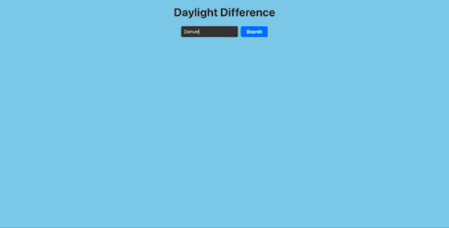

# Daylight Difference 
## Type in the name of any major city and see how much longer or shorter today is compared to yesterday and tomorrow!
## Try it out: https://daylightdifference.netlify.app/
## How it's Made 

#### This project is built with the sunrise-sunset.org API and the API-Ninjas Geocoding API. This project encorporates OOP best practices as well as the fundamentals of asyncronous programming in order to ensure blocking action between the two API calls. 
#### Daylight Difference is a frontend app built with React.

  

